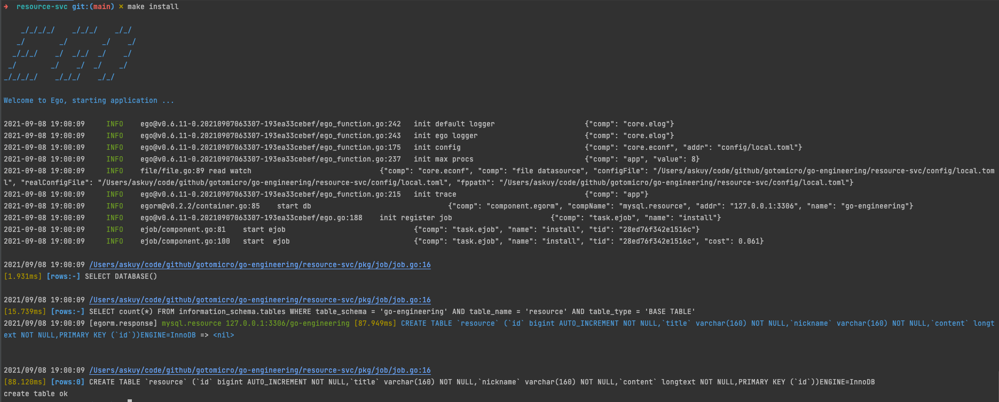

# go-engineering
* 微服务gRPC调用
* 链路
* 限流
* 单元测试
* 监控
* protobuf
* docker compose
* unix domain socket

# 获取用户信息
首页显示github列表

# proto指令
```bash
cd proto
add prototool.yaml
检查格式化 egoctl pb format -d
修改格式化 egoctl pb format -w
打印protobuf egoctl pb generate --dry-run
执行生成pb文件 egoctl pb generate
```

## 



