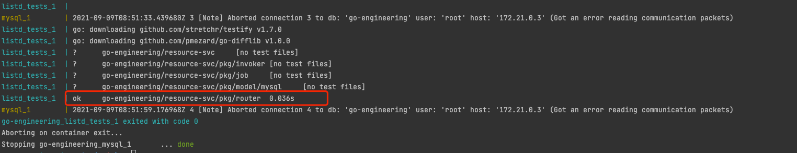

# go-engineering
* 微服务gRPC调用
* 链路
* 限流
* 单元测试
* 监控
* protobuf
* 错误码  
* docker compose
* unix domain socket

# 获取用户信息
# proto指令
```bash
cd proto
add prototool.yaml
检查格式化 egoctl pb format -d
修改格式化 egoctl pb format -w
打印protobuf egoctl pb generate --dry-run
执行生成pb文件 egoctl pb generate
```

## 


## Go语言中的集成测试
在自己的本地环境，如何跑集成测试的单元测试用例
### Resource服务
跑测试用例
* 清除测试缓存 docker-compose -f docker-compose.resource-unittest.yml rm -v
* 跑测试用例 docker-compose -f docker-compose.resource-unittest.yml up --build --abort-on-container-exit
* 跑数据库 docker-compose -f docker-compose.resource-unittest.yml up --build mysql


### API服务

* https://www.ardanlabs.com/blog/2019/03/integration-testing-in-go-executing-tests-with-docker.html
