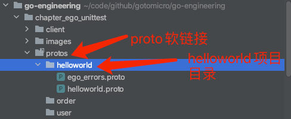
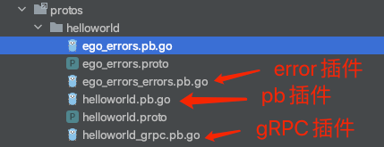
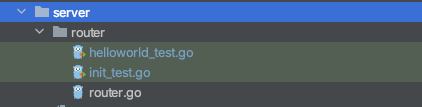

## 介绍
本文介绍EGO服务端如何生成PB、gRPC、错误码、单元测试文件

## 下载工具
使用bash脚本下载工具
```bash
bash <(curl -L https://raw.githubusercontent.com/gotomicro/egoctl/main/getlatest.sh)
```
通过以上脚本，可以下载protoc工具全家桶，以及ego的protoc插件和egoctl
* /usr/local/bin/protoc
* /usr/local/bin/protoc-gen-go
* /usr/local/bin/protoc-gen-go-grpc
* /usr/local/bin/protoc-gen-openapiv2
* /usr/local/bin/protoc-gen-go-errors
* /usr/local/bin/protoc-gen-go-http
* /usr/local/bin/egoctl

## 挂载proto
通常我们的proto在一个统一仓库里，这里为了模拟业务项目软连接proto仓库，我们将proto放在了[外层目录](../chapter_proto)里
我们执行以下指令，可以看到在我们的项目里生成了一个protos目录，我们点开protos目录，可以看到helloworld的项目，这个时候里面只有proto文件
```bash
make link
```


## 生成PB文件
我们在使用`gen-go`,`gen-go-grpc`,`gen-go-errors`插件，生成我们对应的pb文件，在这里我已经准备好了指令，你直接使用该bash脚本
```bash
make gen-proto
```
执行完后，你可以看到三种插件生成的PB代码。



## 生成Test文件
执行以下指令，生成测试文件代码，这里注意下，需要通过`out=./server/router`该参数，将你的测试文件生成到指定目录里
```bash
make gen-test
```


* 初始化test文件的init函数
```go
func init() {
    conf := `
    [server.grpc]
    network = "bufnet" # 使用bufnet模式的测试gRPC服务
    enableAccessInterceptor = true
    enableAccessInterceptorRes = true
    enableAccessInterceptorReq = true
    `
    // 加载配置
    err := econf.LoadFromReader(strings.NewReader(conf), toml.Unmarshal)
    if err != nil {
        log.Fatalf("init exited with error: %v", err)
    }
    
    // 初始化bufnet gRPC的测试服务
    svc = Server()
    
    err = svc.Init()
    if err != nil {
        log.Fatalf("init server with error: %v", err)
    }
    
    go func() {
        // 启动服务
        if err = svc.Start(); err != nil {
            log.Fatalf("Server exited with error: %v", err)
        }
    }()
}
```
你需要在配置里指定`gRPC`服务使用`bufnet`模式启动。

* 编写单元测试逻辑

